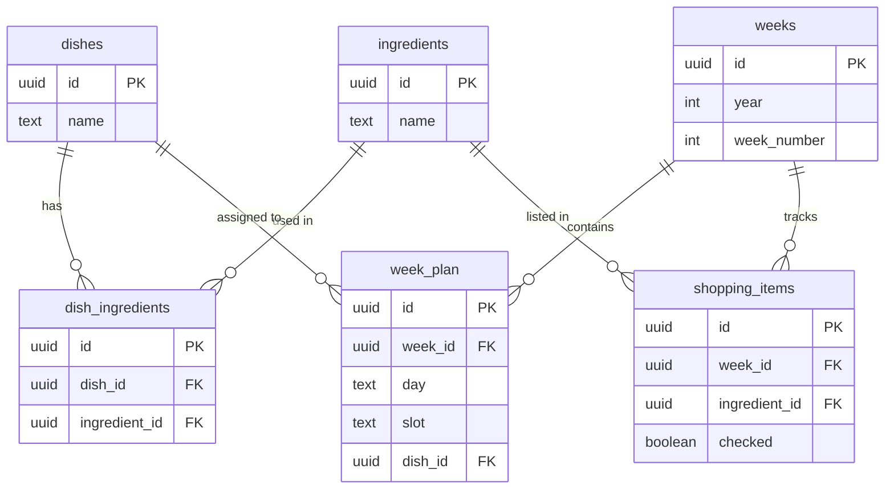

# meal-plan

A mobile app for housemates to collaboratively plan weekly meals and manage a shared shopping list. Built with React Native and Expo, backed by Supabase.

---

## Table of Contents

- [Introduction](#introduction)
- [Features](#features)
- [How to Build and Install](#how-to-build-and-install)
- [App Design](#app-design)
- [App Architecture](#app-architecture)
- [Database Model](#database-model)
- [Internationalisation](#internationalisation)
- [Dependencies and Libraries](#dependencies-and-libraries)

---

## Introduction

meal-plan is a shared household tool that lets housemates:

- Maintain a recipe book with dishes and their ingredients
- Plan meals for each day of the week across lunch and dinner slots
- Automatically generate a shopping list from the weekly plan
- Check off ingredients as they are bought, in real time across all devices

The app is designed for a small group of users (2–4 people) sharing a home. Synchronisation between devices happens automatically via Supabase real-time subscriptions.

---

## Features

- **Dish management** — create, edit and delete dishes with ingredient lists
- **Weekly planner** — assign dishes to lunch and dinner slots for each day, navigate between weeks
- **Shopping list** — auto-generated from the weekly plan, with real-time sync across devices, check-off support, and clipboard export
- **Future week planning** — plan and view shopping lists for upcoming weeks
- **Last used tracking** — each dish shows how many weeks ago it was last cooked
- **Pull to refresh** — swipe down on any screen to force a sync with the database
- **Multi-language** — Basque (default), Spanish and English
- **Settings** — accessible from the header on every screen

---

## How to Build and Install

### Prerequisites

- [Node.js](https://nodejs.org) LTS
- [Expo CLI](https://docs.expo.dev/get-started/installation/)
- [EAS CLI](https://docs.expo.dev/eas/)
- An [Expo account](https://expo.dev)
- A [Supabase](https://supabase.com) project

### 1. Clone and install dependencies

```bash
git clone https://github.com/your-username/meal-plan.git
cd meal-plan
npm install
```

### 2. Configure environment variables

Create a `.env` file in the project root:

```bash
EXPO_PUBLIC_SUPABASE_URL=https://your-project.supabase.co
EXPO_PUBLIC_SUPABASE_PUBLISHABLE_KEY=your-publishable-key
```

Both values are found in your Supabase project under **Settings → API**.

### 3. Set up the database

Run the /sql/database.sql script in the Supabase **SQL Editor**

### 4. Run in development

Install **Expo Go** on your Android device from the Play Store, then:

```bash
npx expo start
```

Scan the QR code shown in the terminal with your camera or from within Expo Go.

### 5. Build and install the APK

Log in to EAS:

```bash
eas login --sso
```

Configure `eas.json` in the project root:

```json
{
  "cli": {
    "version": ">= 5.0.0"
  },
  "build": {
    "preview": {
      "android": {
        "buildType": "apk"
      }
    },
    "production": {
      "android": {
        "buildType": "aab"
      }
    }
  }
}
```

Make sure `app.json` includes an Android package name:

```json
{
  "expo": {
    "name": "meal-plan",
    "slug": "meal-plan",
    "version": "1.0.0",
    "android": {
      "package": "com.yourname.mealplan"
    }
  }
}
```

Build the APK:

```bash
eas build --platform android --profile preview
```

EAS builds in the cloud and provides a download link when complete. Open the link on your Android device, download and install the APK. You may need to enable **Install from unknown sources** in Android settings.

Share the same download link with your housemates to install on their devices.

---

## App Design

The app is structured around three main screens accessible via a bottom tab bar, plus a settings screen reachable from the header.

### Dishes

A scrollable list of dishes displayed as expandable cards. Each card shows the dish name, how long ago it was last used, and its ingredient list when expanded. A floating `+` button opens a bottom sheet to create a new dish. Dishes can be edited or deleted directly from the card.

Ingredients are managed through an autocomplete input that searches existing ingredients in the database as you type. Selecting an existing ingredient reuses it across dishes. If no match is found, a new ingredient is created.

### Week

A weekly planner showing all 7 days at a glance. Each day has 4 slots — lunch 1st, lunch 2nd, dinner 1st and dinner 2nd — indicated by sun and moon icons. Lunch slots use green tones and dinner slots use purple tones. Weekend days have a warm background to distinguish them visually.

Tapping an empty slot opens a searchable dish picker. Tapping a filled slot prompts to remove the dish. Navigation arrows at the top allow moving between weeks. Past weeks are shown in greyscale. Tapping the date label returns to the current week.

### Shopping

An auto-generated shopping list based on the dishes assigned to the selected week. Each ingredient is shown as an expandable card listing which dishes use it that week. Tapping the checkbox marks an ingredient as purchased — it moves to the bottom of the list with a strikethrough style.

The list can be exported to the clipboard in plain text format (`Ingredient x2`). Week navigation follows the same pattern as the planner, but past weeks are disabled — the shopping list only covers the current week and future weeks.

### Settings

Accessible via the gear icon in the top-right header. Contains the language selector.

---

## App Architecture

The app follows a simple client-only architecture. There is no custom backend — all data operations go directly to Supabase via its JavaScript client.
```
┌─────────────────────────────────────┐
│           React Native App          │
│                                     │
│  DishesScreen  WeekScreen  Shopping │
│       │            │           │    │
│       └────────────┴───────────┘    │
│                    │                │
│           Supabase JS Client        │
└────────────────────┬────────────────┘
                     │
          ┌──────────▼──────────┐
          │       Supabase      │
          │  PostgreSQL + RT    │
          └─────────────────────┘
```

### Key design decisions

**No local state persistence** — application data lives entirely in Supabase. `AsyncStorage` is only used to store the selected language.

**Real-time sync** — `ShoppingScreen` subscribes to Supabase real-time changes on `shopping_items`. When one user checks off an ingredient, all other devices update automatically without requiring a manual refresh.

**Optimistic updates** — checking and unchecking shopping items updates the local UI state immediately, then confirms with the database in the background. If the database write fails the UI reverts.

**Lazy week creation** — a row in the `weeks` table is only created when the first dish is assigned to a slot in that week. Empty weeks are never persisted. When the last dish is removed from a week, the week row is deleted unless it has shopping items.

**Automatic cleanup** — past weeks with no `week_plan` entries and no `shopping_items` are deleted on app load to keep the database tidy.

### Project Structure

- `screens/` — one file per tab, responsible for data fetching and screen-level state
- `components/` — reusable UI pieces with no data fetching logic
- `hooks/` — shared business logic (week label formatting, week number calculation)
- `lib/` — external service configuration (Supabase client, i18n setup)

```
meal-plan/
├── app/
│   ├── components/
│   │   ├── DishCard.js           # Expandable dish card with last-used label
│   │   ├── DishModal.js          # Bottom sheet for creating and editing dishes
│   │   ├── IngredientAutocomplete.js  # Search input with dropdown for ingredients
│   │   ├── IngredientCard.js     # Expandable shopping list item
│   │   ├── WeekDishPicker.js     # Searchable dish selector modal for week planner
│   │   └── WeekNavigator.js      # Shared week navigation header component
│   ├── hooks/
│   │   └── useLastUsedLabel.js   # Shared logic for weeks-ago label and colour
│   ├── lib/
│   │   ├── i18n.js               # i18next setup and translation strings
│   │   └── supabase.js           # Supabase client initialisation
│   └── screens/
│       ├── DishesScreen.js       # Recipe book screen
│       ├── ShoppingScreen.js     # Shopping list screen
│       ├── SettingsScreen.js     # Language selector screen
│       └── WeekScreen.js         # Weekly meal planner screen
├── App.js                        # Root component, navigation setup
├── app.json                      # Expo configuration
├── eas.json                      # EAS Build configuration
└── .env                          # Environment variables (not committed)
```

---

## Database Model



### Tables

**`dishes`** — the recipe book. Each dish has a name and belongs to many ingredients via `dish_ingredients`.

**`ingredients`** — a global list of ingredients shared across all dishes. An ingredient is created once and reused across multiple dishes.

**`dish_ingredients`** — join table between dishes and ingredients. Represents which ingredients a dish requires. Deleting a dish cascades to this table.

**`weeks`** — identifies a calendar week by ISO year and week number. Created lazily when the first dish is assigned or a shopping item is added. Deleted when empty.

**`week_plan`** — assigns a dish to a specific day and slot within a week. The combination of `(week_id, day, slot)` is unique — each slot can hold at most one dish. Deleting a dish cascades to this table.

**`shopping_items`** — one row per ingredient per week, tracking whether it has been purchased. Synced automatically from the week plan on app load. Past week items are deleted on startup.

### Cascade behaviour

| Event | Effect |
|---|---|
| Dish deleted | Removed from `dish_ingredients` and `week_plan` |
| Ingredient deleted | Removed from `dish_ingredients` |
| Week deleted | Removes all `week_plan` and `shopping_items` for that week |

---

## Localization

The app supports three languages:

| Code | Language | Default |
|---|---|---|
| `eu` | Basque (Euskera) | ✅ |
| `es` | Spanish (Castellano) | |
| `en` | English | |

Language selection is persisted in `AsyncStorage` and loaded on startup. All UI strings are defined in `app/lib/i18n.js` using `i18next`. Components access translations via the `useTranslation` hook from `react-i18next`.

The selected language can be changed at any time from the Settings screen without restarting the app.

---

## Dependencies and Libraries

| Library | Version | Purpose |
|---|---|---|
| `expo` | ~52 | App framework and build tooling |
| `react-native` | 0.76 | Mobile UI framework |
| `@supabase/supabase-js` | ^2 | Database client and real-time subscriptions |
| `@react-navigation/native` | ^6 | Navigation container |
| `@react-navigation/bottom-tabs` | ^6 | Bottom tab bar |
| `@react-navigation/native-stack` | ^6 | Stack navigation for Settings screen |
| `react-native-screens` | ~4.16 | Native screen optimisation |
| `react-native-safe-area-context` | ~5.6 | Safe area insets |
| `@react-native-async-storage/async-storage` | 2.2.0 | Local persistence (language preference) |
| `@expo/vector-icons` | ^14 | Ionicons icon set |
| `expo-clipboard` | ~7 | Copy shopping list to clipboard |
| `i18next` | ^23 | Internationalisation framework |
| `react-i18next` | ^14 | React bindings for i18next |

---

